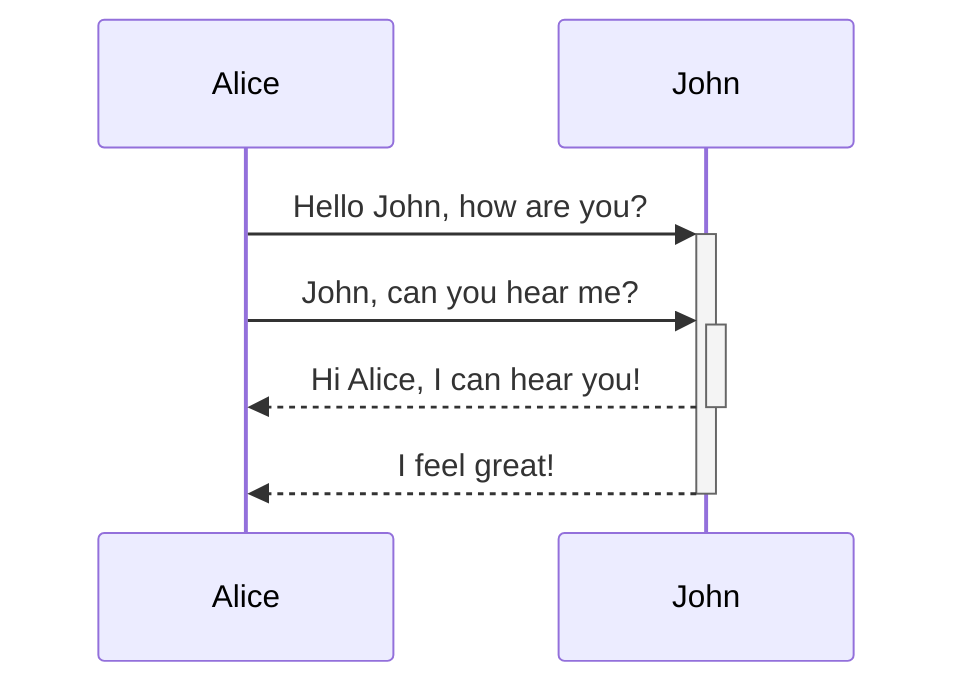
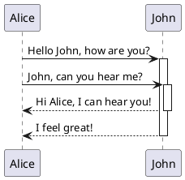

[Convert PlantUML Syntax to Renderable Link](#convert-plantuml-syntax-to-renderable-link)
- [Problem](#problem)
[Diagramming Tools](#diagramming-tools)
[Diagram Rendering](#diagram-rendering)
    - [Mermaid](#mermaid)
    - [PlantUML](#plantuml)
  - [Solution](#solution)
- [Why Use PlantUML](#why-use-plantuml)
- [Script Overview](#script-overview)
- [How to Use the Script](#how-to-use-the-script)
- [FAQ](#faq)
  - [Why Not Use a PlantUML Plugin?](#why-not-use-a-plantuml-plugin)

# Convert PlantUML Syntax to Renderable Link
This script converts PlantUML diagram syntax into a URL that can be previewed directly within markdown files. It updates or inserts a renderable link after each fenced PlantUML code block in a markdown (*.md) file.

# Problem
## Diagramming Tools
Diagrams are a great way to enhance code documentation. Some of the best code-to-diagram tools include:
- [Mermaid.js](https://mermaid.js.org/)
- [PlantUML](https://plantuml.com/)

These tools use UML-based diagram description syntax, which needs to be rendered into actual images.

## Diagram Rendering 
The ideal solution is to render diagrams directly in a web browser. For example, GitHub supports Mermaid.js diagram rendering in the browser. However, in many cases, I prefer using PlantUML for the reasons listed below. Unfortunately, GitHub's markdown rendering engine does not natively support PlantUML syntax.

### Mermaid 
GitHub supports Mermaid diagrams rendering directly in the browser:


### PlantUML

PlantUML syntax, however, is displayed as plain code:


## Solution

This Python script converts PlantUML syntax into a PlantUML server-renderable link. The link is an [encoded version of the PlantUML diagram syntax](https://plantuml.com/text-encoding).

The generated link looks like this:

```text
https://www.plantuml.com/plantuml/svg/TSun3i8m30NGFQVudTjSW07AHhc5LJwaafj88HNYzZZDYEhjo-zR7jz5SjbMTLTTPlepxYb4zFq9DwgcFGu8wGF9n3Tj5mURFztSBB4Q14h6ocRhoflTE_3UJYyj39XgfN7hTGT-mfDKl3AbT6vaVDZ7Fm00
```

> View the rendered [link](https://www.plantuml.com/plantuml/svg/TSun3i8m30NGFQVudTjSW07AHhc5LJwaafj88HNYzZZDYEhjo-zR7jz5SjbMTLTTPlepxYb4zFq9DwgcFGu8wGF9n3Tj5mURFztSBB4Q14h6ocRhoflTE_3UJYyj39XgfN7hTGT-mfDKl3AbT6vaVDZ7Fm00) on a PlantUML web server.

By including this link in a markdown image syntax (``), you can render it on a web server, fetching the diagram as a PNG, SVG, or ASCII art. It can also be [rendered locally](https://plantuml.com/starting) using Docker or Java runtime.

### WEB-server diagram rendered from a generated link:


# Why Use PlantUML

- [Link support](https://plantuml.com/link), making it especially useful for referencing source code.
- A wide variety of diagram types and customizable visual elements.
- Precise control over the rendering process.
- Support for importing open-source elements like [C4 model components](https://github.com/plantuml-stdlib/C4-PlantUML).

These features make PlantUML more complex than Mermaid.js, but it offers greater flexibility. Ultimately, choosing between Mermaid and PlantUML is a matter of preference and specific use cases.

# Script Overview

- Processes markdown files containing PlantUML syntax.
- Automatically refreshes links when changes are made to the diagram syntax.

# How to Use the Script

1. Specify the folder containing the markdown file. If the file is in the current working directory (CWD), leave this field empty.
2. Input the markdown file name.
3. Adjust the `PLANTUML_BASE_URL` variable if you want to render locally or change the WEB server.
4. Run the script.
5. Make changes to the diagram in the markdown file.
6. Save the changes.
7. Repeat steps 4-6 as needed.

# FAQ

## Why Not Use a PlantUML Plugin?

- The PlantUML VSCode plugin supports rendering for `.puml` files, but not for markdown files containing one or more fenced PlantUML code blocks.
- This script avoids the hassle of refreshing every time changes are made, which is especially useful during diagram development.
- Plugins cannot be used to render markdown files on platforms like GitHub, GitLab, or other web services.
